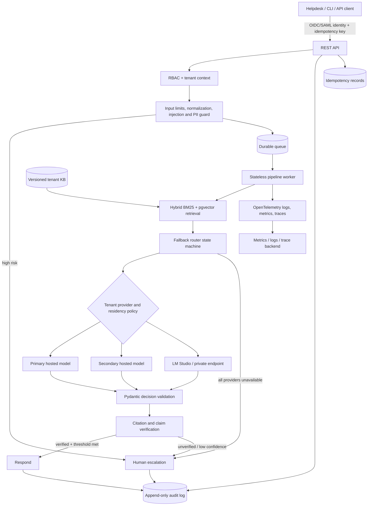

# Architecture

## Assumptions and decisions pending ADR approval

- Python 3.12, FastAPI, Pydantic v2, and Typer form the application stack.
- PostgreSQL row-level security provides tenant isolation; every tenant-owned table carries a
  non-null `tenant_id`. This is less operationally expensive than one schema per tenant while
  retaining database-enforced isolation.
- PostgreSQL plus pgvector is the initial vector store, reducing consistency and backup surface.
- The model layer is provider-neutral. LM Studio is supported for development and approved private
  deployments through its OpenAI-compatible endpoint. It is never an implicit fallback for a
  tenant whose policy does not allow it.
- Authentication terminates at an OIDC/SAML identity broker; authorization is enforced inside every
  endpoint and worker command.
- The target cloud and managed queue are intentionally undecided. The code depends on queue and
  secret-provider interfaces until a deployment platform is selected.

## Hardened request flow

Every stage accepts a correlation ID and tenant context. Ticket text is redacted before it crosses
a provider boundary. The final action defaults to escalation on timeout, invalid JSON, invalid
citations, policy denial, or an exhausted fallback chain.

## Component boundaries

| Component | Input | Output | Fail-safe behavior |
|---|---|---|---|
| Ingestion | Ticket and tenant context | Sanitized/redacted ticket or risk finding | Escalate |
| Retrieval | Sanitized text and KB version | Ranked immutable chunks | Escalate if evidence is insufficient |
| Decision engine | Ticket plus retrieved chunks | Validated `Decision` | Provider failure |
| Fallback router | Provider policy and request | First valid decision | Escalate after exhaustion |
| Verification | Decision plus exact retrieved chunks | Verified decision or rejection | Escalate |

## Deployment topology

The API and workers are separate stateless containers. Durable state belongs in PostgreSQL, the
queue, object storage, and the append-only audit sink. Network policy restricts workers to the queue,
database, telemetry collector, secret manager, and tenant-approved model endpoints. TLS 1.2 or newer
is required between components. Production secrets are injected from a secrets manager at runtime.

